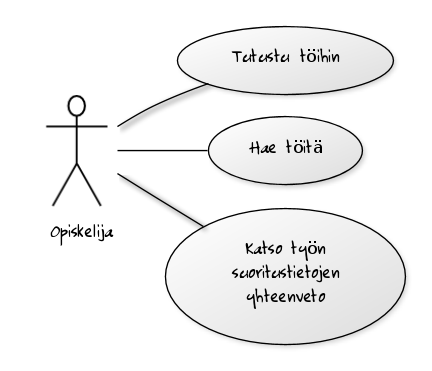
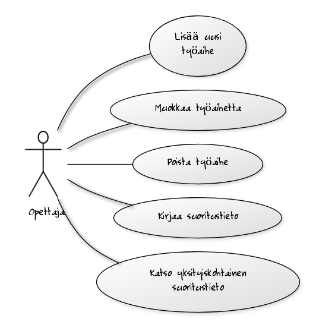

# Dokumentaatio

## Johdanto

Työn on tarkoitus toimia harjoitustyön aiheen valintaa helpoittavana työkaluna. Sivulla listataan harjoitustyön aiheita. Sivulla näytetään kuinka monta kertaa työ on tehty, kuinka paljon siihen on kulunut aikaa ja mikä arvosana työstä on annettu.

Ajattelin kirjoittaa softan PHP:llä ja laittaa sen laitoksen users-palvelimelle. Tietokantana käytän PostgreSQL:ää. En aio tukea muita kantoja.

En ajatellut kirjoittaa javascriptiä tai mitään muuta erikoista sovelluksessa, eli käyttäjän selaimen ei tarvitse tukea mitään erikoista.

## Yleiskuva järjestelmästä

### Käyttötapauskaavio

\ 

\ 

\ 

### Käyttäjäryhmät

* Opiskelija: Henkilö, joka etsii harjoitustyönsä aihetta. Ohjelma olettaa, että kaikki kirjautumattomat käyttäjät ovat opiskelijoita.
* Opettaja: Sisään kirjautunut käyttäjä, joka hallinnoi aiheita ja suoritustietoja.
* Ylläpito: Etuoikeutettu käyttäjä, joka voi hallinnoi muiden tietoja.

### Käyttötapaukset

#### Opiskelija

* Selaa töitä: Käy läpi töiden listaa.
* Hae töitä: Suodattaa töitä luokittelutekijöiden mukaisesti
* Katso työn tietoja: Näyttää kuinka paljon yksittäinen työ on keskimäärin kestänyt, mikä on työn keskimääräinen arvosana ja keskeytysten lukumäärä.

#### Opettaja

* Lisää uusi työaihe
* Muokkaa työaihetta
* Poista työaihe
* Kirjaa suoritustieto
* Muokkaa suoritustietoa
* Poista suoritustieto
* Katso työn yksityiskohtaiset tiedot: Näyttää samat tiedot kuin opiskelijalle, mutta yksityiskohtaisemmin.
* Kirjaudu sisään
* Kirjaudu ulos
* Katso yhteenveto töiden käytöstä: Näyttää hienoja tilastoja kaikista töistä

#### Ylläpito

* Muokkaa käyttäjätunnusten tietoja: muokkaa ja luo käyttäjätunnuksia.
* Kirjaudu sisään
* Kirjaudu ulos
