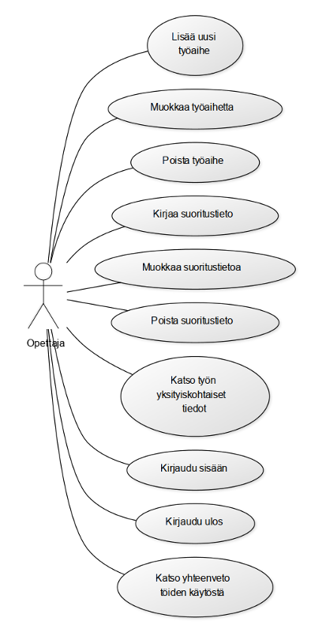
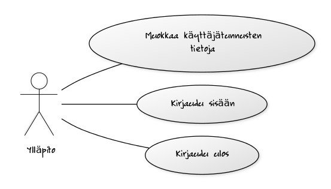

# Dokumentaatio

## Johdanto

Työn on tarkoitus toimia harjoitustyön aiheen valintaa helpoittavana työkaluna.

Ajattelin kirjoittaa softan PHP:llä ja laittaa sen laitoksen users-palvelimelle. Tietokantana käytän PostgreSQL:ää. En aio tukea muita kantoja.

En ajatellut kirjoittaa javascriptiä tai mitään muuta erikoista sovellukssessa, eli käyttäjän selaimen ei tarvitse tukea mitään erikoista.

## Yleiskuva järjestelmästä

### Käyttötapauskaavio

\ 

\ 

\ 

### Käyttäjäryhmät

* Opiskelija
* Opettaja
* Ylläpito

### Käyttötapaukset

#### Opiskelija

* Tutustu töihin: selaa työaiheiden listaa
* Hae töitä: suodata töitä suodatuskriteerien mukaisesti.

#### Opettaja
#### Ylläpito
